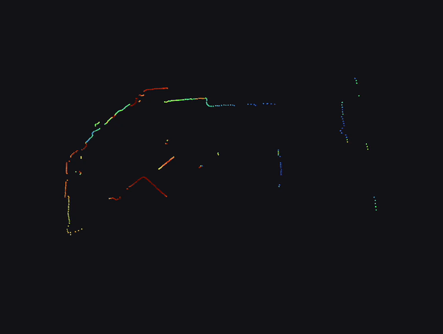

# ROS2 Node for the LD19 LIDAR sensor




## Hardware details

<https://www.waveshare.com/wiki/DTOF_LIDAR_LD19>

## Where to buy

<https://www.aliexpress.us/item/3256804109024401.html>

## Installation

Setup device alias to `/dev/ldlidar`

```sh
sudo apt install libudev-dev

cat << EOF | sudo tee /etc/udev/rules.d/99-ldlidar.rules
# set the udev rule , make the device_port be fixed by ldlidar
# CP210x USB Device
KERNEL=="ttyUSB*", ATTRS{idVendor}=="10c4", ATTRS{idProduct}=="ea60", MODE:="0777", SYMLINK+="ldlidar"
EOF

sudo udevadm control --reload-rules
sudo udevadm trigger
```

Check it:

```sh
screen -L /dev/ldlidar 230400
```

### Compile

```sh
cd src
git clone https://github.com/mattwilliamson/ld19_lidar.git
colcon build --symlink-install --packages-select=ld19_lidar
```

## Running

```sh
source install/setup.sh
ros2 launch ld19_lidar lidar.launch.py
```

## Credits

Thank you to these repos for doing all the hard work:

- <https://github.com/richardw347/ld19_lidar>
- <https://github.com/Myzhar/ldrobot-lidar-ros2>
